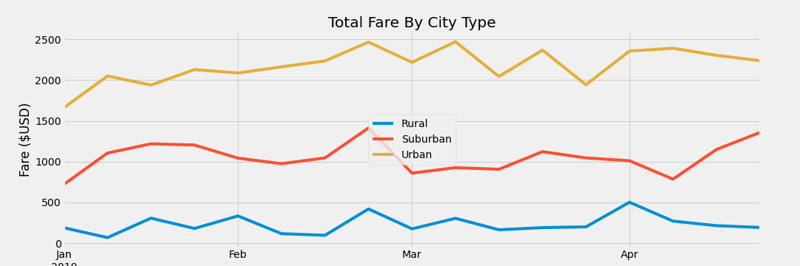

# PyBer_Analysis

## Project Overview:

PyBer, a ride-sharing App, has requested a summary Data Frame of their ride-sharing data by city type.  As well as a line graph to show the total weekly fares for each city type (Rural, Suburban, and Urban.

## Resources:

 Data Source: [ride_data.csv](Resouces/ride_data.csv), [city_data.csv](Resouces/city_data.csv), [PyBer_ride_data.csv](Resouces/PyBer_ride_data.csv)
 
 Software: Jupyter Notebook, Anaconda 4.10.1, Python 3.7.6, Visual Studio Code, 1.56.0
 
 Code: [PyBer_Challenge.ipynb](PyBer_Challenge.ipynb)

Images: [analysis](analysis)

## Overview of Analysis:

## Results:

There is a description of the differences in ride-sharing data among the different city types. Ride-sharing data include the total rides, total drivers, total fares, average fare per ride and driver, and total fare by city type. (7 pt)

## Summary:

There is a statement summarizing three business recommendations to the CEO for addressing any disparities among the city types. (4 pt)
