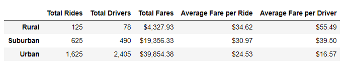

# PyBer_Analysis

## Project Overview:

PyBer, a ride-sharing App, has requested a summary Data Frame of their ride-sharing data by city type.  As well as a line graph to show the total weekly fares for each city type (Rural, Suburban, and Urban).

## Resources:

Data Source: [ride_data.csv](Resouces/ride_data.csv), [city_data.csv](Resouces/city_data.csv), [PyBer_ride_data.csv](Resouces/PyBer_ride_data.csv)
 
Software: Jupyter Notebook, Anaconda 4.10.1, Python 3.7.6, Visual Studio Code, 1.56.0
 
Code: [PyBer_Challenge.ipynb](PyBer_Challenge.ipynb)

Images: [analysis](analysis)

## Results:

### City Type Summary

### Weekly Fares Summary

## Summary:

From the new data frame we created and analyized it is easy to see a breakdown in performances in city types over the requested categories.

Rural cities have the lowest amount of rides and drivers, which equates to the lowest amount of revenue in fares but it does amount to the largest average fare per ride and the highest average fare per driver.  This is probably because of population size versus the length of the trip.

Urban cities have the largest amount of rides and drivers with the highest amount of revenue generated in fares.  Urban cities also have the lowest average fares per ride and average fares per driver.  This could be because there are more drivers competeing for fares with other companies and shorter distances travelled per ride.

Suburban cities fall in the middle of each category measured.

## Recommendations:

1. For the Urban market, to keep drivers happy, an increase in the starting fare would help.  They are by far the lowest earners per ride.     
2. The Suburban market has the most growth appeal.  Targeting users that need a car to get to a train, bus or subway to commute into an Urban area for work could spike usership.  I could see an increase in the winter months from people not wanting to shovel the driveway, clean off their vehicles, and leave for work in a one of our driver’s warm cars.
3. To capitalize on the Rural markets, I would look to increase the advertising campaign and add more drivers to those areas.  A bigger presence should attract more users.  Maybe a flat fee to entice a steady userbase.
